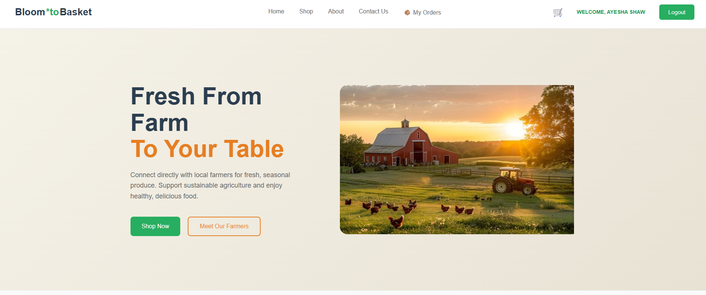
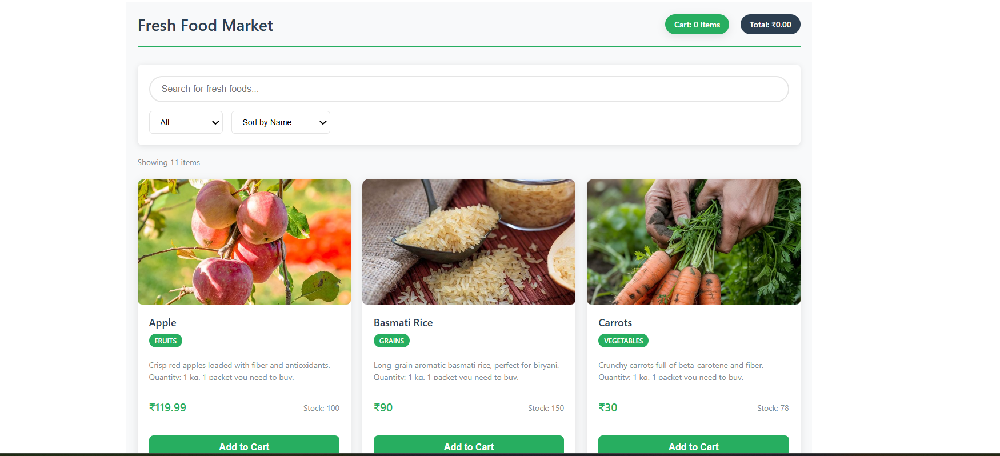
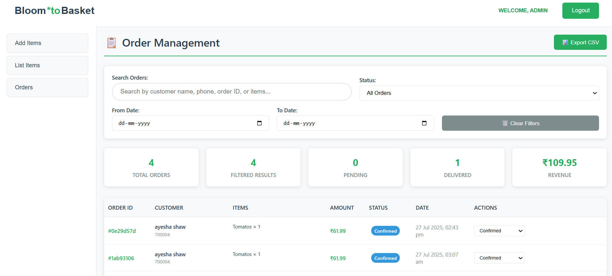

# Bloom to Basket (Order Management System)

A full-stack food ordering application built with React and Node.js, featuring user authentication, food management, order processing, and payment integration.

## 🚀 Deployed Link
**Live Demo:** https://bloom-to-basket.vercel.app/

## 🚀 Features

- **User Authentication**: Secure login and registration system
- **Food Menu Management**: Browse and search food items
- **Shopping Cart**: Add/remove items with quantity management
- **Order Management**: Place orders and track order status
- **Payment Processing**: Integrated with Stripe for secure payments
- **Admin Panel**: Comprehensive admin dashboard for managing the entire system
- **Responsive Design**: Works seamlessly on desktop and mobile devices
- **File Upload**: Support for food images using Multer

## 🛠️ Technologies Used

### Backend
- **Node.js**: JavaScript runtime environment
- **Express.js**: Web application framework
- **MongoDB**: NoSQL database for data storage
- **Mongoose**: MongoDB object data modeling (ODM)
- **JWT**: JSON Web Tokens for authentication
- **bcryptjs**: Password hashing and encryption
- **Multer**: File upload handling for images
- **CORS**: Cross-Origin Resource Sharing
- **Validator**: String validation and sanitization

### Frontend
- **React**: JavaScript library for building user interfaces
- **Vite**: Fast build tool and development server
- **React Router DOM**: Client-side routing
- **Axios**: HTTP client for API requests
- **Context API**: Global state management
- **CSS3**: Styling and responsive design

## 📁 Project Structure

```
├── backend/
│   ├── config/                 # Database configuration
│   ├── controllers/            # Business logic controllers
│   │   ├── foodControllers.js  # Food-related operations
│   │   ├── orderControllers.js # Order management
│   │   └── userControllers.js  # User authentication
│   ├── middlewears/            # Custom middleware functions
│   ├── models/                 # Mongoose data models
│   │   ├── foodModels.js       # Food item schema
│   │   ├── ordersModel.js      # Order schema
│   │   └── userModel.js        # User schema
│   ├── routers/                # API route definitions
│   ├── upload/                 # File upload directory
│   ├── server.js               # Main server file
│   └── package.json            # Backend dependencies
│
├── frontend/
│   ├── public/                 # Static assets
│   ├── src/
│   │   ├── admin/              # Admin panel components
│   │   ├── assets/             # Images and static files
│   │   │   └── images/         # Image assets
│   │   ├── components/         # Reusable UI components
│   │   │   ├── Footer/         # Footer component
│   │   │   ├── Header/         # Header component
│   │   │   ├── Menu/           # Menu components
│   │   │   └── Navbar/         # Navigation bar
│   │   ├── context/            # React Context for state management
│   │   │   └── AppContext.jsx  # Global application context
│   │   ├── pages/              # Application pages/views
│   │   ├── App.jsx             # Main App component
│   │   ├── App.css             # Global styles
│   │   └── main.jsx            # Application entry point
│   ├── index.html              # HTML template
│   ├── vite.config.js          # Vite configuration
│   └── package.json            # Frontend dependencies
│
├── .env                        # Environment variables
├── .gitignore                  # Git ignore rules
└── README.md                   # Project documentation
```

## ⚙️ Setup and Installation

### Prerequisites
- Node.js (v14 or higher)
- MongoDB (local installation or MongoDB Atlas)
- npm or yarn package manager

### 1. Clone the Repository

```bash
git clone https://github.com/ayeshashaw/Bloom-to-Basket-Order-Management-System-.git
cd bloom-to-basket
```

### 2. Backend Setup

```bash
# Navigate to backend directory
cd backend

# Install dependencies
npm install

# Create environment variables file
touch .env
```

#### Environment Variables
Create a `.env` file in the backend directory with the following variables:

```env
MONGODB_URI=mongodb://localhost:27017/food-ordering
JWT_SECRET=your_jwt_secret_key
PORT=5000
STRIPE_SECRET_KEY=your_stripe_secret_key
```

```bash
# Start the backend server
npm start
# or for development with nodemon
npm run dev
```

### 3. Frontend Setup

```bash
# Open a new terminal and navigate to frontend directory
cd frontend

# Install dependencies
npm install

# Start the development server
npm run dev
```

## 🌐 Usage

1. **Access the Application**: Open your browser and navigate to `http://localhost:5173`
2. **User Registration**: Create a new account or log in with existing credentials
3. **Browse Menu**: Explore available food items and add them to your cart
4. **Place Orders**: Review your cart and proceed to checkout
5. **Payment**: Complete payment using Stripe integration
6. **Admin Access**: Use admin credentials to access the management panel

## 🔐 Admin Access

The application includes a comprehensive admin panel for managing food items, orders, and users.

### 🛂 Default Admin Credentials

```
Email:    admin@gmail.com
Password: admin123
```

> ⚠️ **Important**: These credentials are pre-seeded for testing and demonstration purposes only. Please change them in production environments.

### 📋 Admin Capabilities

Once logged in as an admin, you will have access to:

- **🍕 Food Management**: Create, update, and delete food items
- **📦 Order Management**: View all orders and update order statuses
- **👥 User Management**: View and manage all registered users
- **📊 Dashboard Analytics**: Overview of sales, orders, and system statistics
- **🖼️ Image Upload**: Upload and manage food item images

### 🔒 Protected Admin Routes

The following routes are only accessible to authenticated admins:

- `/admin/dashboard` – Overview of orders and statistics
- `/admin/foods` – Manage food items and menu
- `/admin/orders` – View and manage all customer orders
- `/admin/users` – User management panel

Unauthorized users will be automatically redirected to the login page when attempting to access these routes.

### 🚪 How to Access Admin Panel

1. Visit the application: [https://bloom-to-basket.vercel.app/](https://bloom-to-basket.vercel.app/)
2. Click on "Login" in the navigation
3. Enter the admin credentials listed above
4. You'll be redirected to the admin dashboard upon successful authentication

## 🔑 API Endpoints

### Authentication
- `POST /api/auth/register` - User registration
- `POST /api/auth/login` - User login
- `GET /api/auth/profile` - Get user profile
- `POST /api/auth/logout` - User logout

### Food Management
- `GET /api/food` - Get all food items
- `POST /api/food` - Add new food item (Admin only)
- `PUT /api/food/:id` - Update food item (Admin only)
- `DELETE /api/food/:id` - Delete food item (Admin only)
- `GET /api/food/:id` - Get specific food item

### Orders
- `POST /api/orders` - Create new order
- `GET /api/orders` - Get user orders
- `GET /api/orders/all` - Get all orders (Admin only)
- `PUT /api/orders/:id` - Update order status (Admin only)
- `DELETE /api/orders/:id` - Cancel order

### Payment
- `POST /api/payment/create-intent` - Create Stripe payment intent
- `POST /api/payment/confirm` - Confirm payment

## 🚀 Deployment

### Backend Deployment
1. Choose a hosting platform (Heroku, Railway, DigitalOcean, Render)
2. Set up environment variables on your hosting platform
3. Configure MongoDB connection (MongoDB Atlas recommended for production)
4. Deploy using platform-specific instructions

### Frontend Deployment
1. Build the production version:
```bash
npm run build
```
2. Deploy to hosting platform (Vercel, Netlify, GitHub Pages)
3. Update API endpoints to point to your deployed backend URL

### Environment Variables for Production
Ensure you set up the following environment variables in your production environment:
- `MONGODB_URI` - Your MongoDB connection string
- `JWT_SECRET` - A secure JWT secret key
- `STRIPE_SECRET_KEY` - Your Stripe secret key
- `PORT` - Port number (usually provided by hosting platform)

## 📸 Screenshots


*Home page with featured food items and hero section*


*Complete food menu with category filters*


*Order management and tracking interface*

## 🧪 Testing

To run tests (if implemented):

```bash
# Backend tests
cd backend
npm test

# Frontend tests
cd frontend
npm test
```

## 🤝 Contributing

We welcome contributions! Please follow these steps:

1. Fork the repository
2. Create a feature branch (`git checkout -b feature/amazing-feature`)
3. Commit your changes (`git commit -m 'Add some amazing feature'`)
4. Push to the branch (`git push origin feature/amazing-feature`)
5. Open a Pull Request

### Development Guidelines
- Follow the existing code style
- Write clear commit messages
- Test your changes thoroughly
- Update documentation as needed

## 📝 License

This project is licensed under the MIT License - see the [LICENSE](LICENSE) file for details.

## 👥 Authors

- **Ayesha Shaw** - *Initial work* - [GitHub Profile](https://github.com/ayeshashaw)

## 🙏 Acknowledgments

- React community for excellent documentation
- Express.js team for the robust framework
- MongoDB for flexible data storage
- Stripe for secure payment processing
- Vite for the amazing build tool

## 📞 Support

If you have any questions or need support, please:

- 🐛 Open an issue on [GitHub Issues](https://github.com/ayeshashaw/Bloom-to-Basket-Order-Management-System-/issues)
- 📧 Email: ayeshashaw520@gmail.com
- 💼 Connect on LinkedIn: [Ayesha Shaw](https://www.linkedin.com/in/ayesha-shaw)

## 🔧 Built With

- [React](https://reactjs.org/) - Frontend framework
- [Node.js](https://nodejs.org/) - Backend runtime
- [Express](https://expressjs.com/) - Web framework
- [MongoDB](https://www.mongodb.com/) - Database
- [Vite](https://vitejs.dev/) - Build tool
- [Stripe](https://stripe.com/) - Payment processing

## 🐛 Known Issues

- None currently reported

## 🗺️ Roadmap

- [ ] Add email notifications for orders
- [ ] Implement real-time order tracking
- [ ] Add customer reviews and ratings
- [ ] Mobile app development
- [ ] Multi-language support

---

⭐ **Star this repository if you found it helpful!**

**Happy Coding! 🍕🚀**
